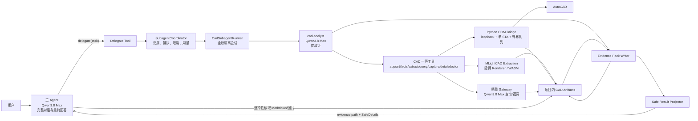
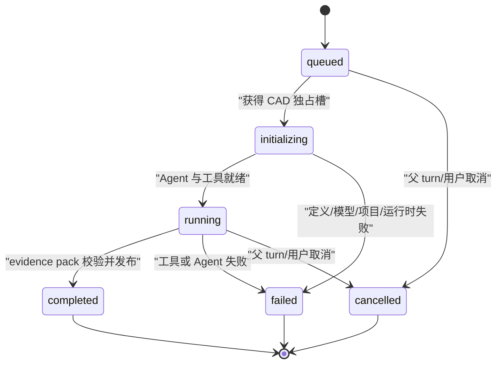
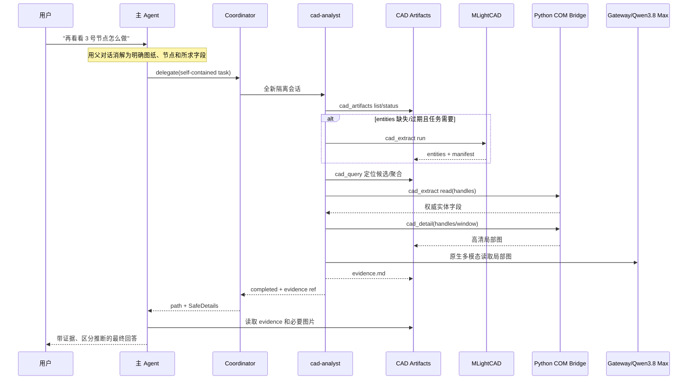

# 目标架构：主 Agent + 隔离 cadsubagent

状态：Accepted

依赖：[README.md](./README.md)

## 1. 架构目标

目标不是让多个 Agent 共享同一段 CAD 上下文，而是把职责和证据流切开：

- 主 Agent 拥有用户对话上下文和最终解释权。
- cadsubagent 拥有 CAD 运行能力和一次任务所需的临时上下文。
- CAD bridge 拥有 AutoCAD COM 引用和串行执行权。
- 项目产物目录拥有可复用证据；数据库只保存索引、状态和用量引用。

主 Agent 不需要知道 cadsubagent 如何尝试定位，也不应被几十个 CAD ToolResult、全量实体或批量截图污染。cadsubagent 也不需要看到父会话历史，它只接收主 Agent 已消解指代的自包含任务。

## 2. 三套实现的对比与目标取舍

| 维度 | 当前晓量 | pi-engineering | grok-build | 晓量目标 |
| --- | --- | --- | --- | --- |
| 主 Agent CAD 能力 | 多个原子/复合 CAD 工具直接可见 | 只看到固定 `delegate` | 通用 task/spawn 工具 | 首期只看到固定 `delegate({task})` |
| 子会话 | 无，CAD 流程位于主 Agent 会话管理器 | 新进程、无 session、无 extensions | 独立 child session，由 coordinator 管理 | 新的独立 Pi Agent，会话和工具完全隔离 |
| 父上下文继承 | 不适用，全部混在父上下文 | 不继承，父先形成自包含任务 | 可 fork/resume 父或旧 child 上下文 | CAD 永不 fork 父 transcript；首版不 resume |
| child 输出 | 不适用 | evidence pack；父只收路径和安全元数据 | 通常把 child summary 返回父 | 采用 evidence pack 和 SafeDetails，不回 child transcript |
| 实体索引 | 手动触发 COM 全图扫描 | MLightCAD 默认，COM fallback/权威读取 | 非 CAD 架构 | MLightCAD 快索引，COM 只做权威读数和 fallback |
| 视觉概览 | 手动触发，多窗口规划和多轮识别 | 全图 + 四象限 + `needs_zoom` 二级象限 | 非 CAD 架构 | 原样采用确定性两级象限，最多 21 图 |
| 精读 | 主 Agent 驾驶多个高级/原子工具 | handle/bbox 定位后 `cad_detail` | 非 CAD 架构 | cadsubagent 自动 query → COM read → detail → 证据 |
| CAD 并发 | 局部队列，整体边界不统一 | 全局一个 CAD child | 通用可配置并发、排队或失败 | coordinator 通用，CAD admission 固定 1、FIFO |
| 生命周期 | UI busy/phase 分散 | 前台、无状态 child | initializing/running/terminal、取消、归属 | 借用 grok 生命周期和 parent turn 取消语义 |
| 产物 | Electron userData + SQLite 状态 | 项目内 manifest + staging | child session/工作树持久化 | 项目内 `.xiaoliang/cad` + 内部 child trace |
| 模型 | 逻辑 alias 已在向 Qwen3.8 Max 收敛 | Qwen3.8 Max 主/子/视觉 | 可按 agent/role 覆盖 | 所有链路固定解析到 Qwen3.8 Max |

核心取舍是：CAD 工作流采用 pi-engineering 的专业窄面；运行调度采用 grok-build 的通用内核。不能反过来用一个全能通用 child 自由驾驶 AutoCAD。

## 3. 总体组件图



## 4. 主 Agent 边界

主 Agent 保留：

- 完整用户对话、项目选择、工程知识、规范/联网资料和最终答案。
- 将“再看看”“继续”“这个节点”等指代解析成明确的 DWG、区域、构件和问题。
- 调用 `delegate`，读取 evidence pack，并选择性查看其中真正相关的局部图片。
- 区分直接图纸证据、模型推断、项目资料和外部知识。

主 Agent 不再拥有：

- `CadRuntimeService`、AutoCAD COM、MLightCAD 或 Python bridge client。
- CAD connect/open/switch/extract/query/zoom/pan/capture/plot/detail 等模型可见工具。
- 全量 `entities.raw.jsonl`、child transcript、批量图像 data URL 或 bridge token。
- “缺实体索引时请用户点击按钮”的提示逻辑。
- CAD 图纸结构化摘要和视觉知识的常驻大段上下文注入。

模型可见的 CAD 入口首期固定为：

```ts
delegate({ task: string }): {
  content: "CAD evidence pack saved...";
  details: SafeDetails;
}
```

内部 coordinator 可以支持多 agent type，但首期不能把 `agent_type`、model override、capability mode 或任意 cwd 暴露给主模型。这些只能由代码控制的 agent definition 决定。

## 5. Subagent 内核

### 5.1 组件

| 组件 | 职责 |
| --- | --- |
| `AgentDefinitionRegistry` | 加载代码随包发布的 agent 定义，校验名称、模型、工具 allowlist、深度和输出契约 |
| `SubagentCoordinator` | 唯一生命周期状态机；持有 mailbox、admission、运行表、FIFO 队列和完成通知 |
| `SubagentRunner` | 创建全新的 Pi `Agent`，构造 child system prompt、工具和项目环境，执行并采集事件 |
| `SubagentRunStore` | 持久化内部 trace、状态、错误、usage、parent session/turn 归属和 retention 信息 |
| `EvidencePackWriter` | 将 child 最终证据文本写入受信项目目录；child 本身没有任意写文件工具 |
| `SafeResultProjector` | 删除 transcript、图片、base64、绝对路径、秘密和超长内容，只投影固定安全字段 |
| `UsageAggregator` | 把 child Agent、`cad_query`、视觉索引等调用归集到原用户 `client_run_id` 与 `child_run_id` |

### 5.2 请求模型

内部请求至少包含：

```ts
interface SubagentRequest {
  childRunId: string
  type: 'cad-analyst'
  task: string
  parentSessionId: string
  parentPromptId: string
  clientRunId: string
  projectId: string
  projectRoot: string
  model: 'qwen3.8-max'
  thinkingMode: 'fast' | 'deep'
  runInBackground: false
  cancellation: AbortSignal
}
```

`projectRoot` 必须来自数据库中已绑定且经过 realpath 校验的项目，不能接受模型输入。`clientRunId` 继承当前收费/配额 run，不能为 child 创建绕过计费的自由调用。

### 5.3 生命周期



运行状态向 UI 投影 `description/phase/lastTool/turns/toolCalls/tokens/duration/queueDepth`。任何状态都不得投影模型原始 reasoning 或工具正文。

首版 `delegate` 在前台等待。若耗时证明需要后台执行，再在不改变 evidence 契约的前提下增加 background/get/cancel；不能为了 UI 流畅先引入 resume 或父上下文 fork。

## 6. cadsubagent 边界

运行时 ID 使用 `cad-analyst`，代码域可使用 `cad-subagent`。该 child：

- 每次委派创建全新消息数组，不加载父会话 snapshot。
- system prompt 只由 agent definition、受信项目环境和本次 task 组成。
- 不运行父会话的 `transformContext`，不注入 workspace memory、CAD catalog、近期图片或构件教学 preflight。
- 工具固定为只读文件检索和 CAD 一等工具；无 shell、write/edit、通用网络、delegate 或任意 MCP。
- `maxSubagentDepth=0`，不能生成孙子 Agent。
- 最终输出是证据清单，不是用户答案；由宿主写入 evidence pack。
- 同一批 handle 合并为一次 COM 权威读取；同一有效索引不得重复 force 抽取。

agent definition、工具契约和精读规则见 [02-cadsubagent-contracts.md](./02-cadsubagent-contracts.md)。

## 7. 四层隔离不变量

### 7.1 模型上下文隔离

- 父 transcript 不进入 child。
- child transcript、reasoning 和中间 ToolResult 不进入父。
- 主 Agent 只有在 `delegate` 完成后，主动读取 evidence pack；图片也只在主 Agent 判断必要时逐张读取。
- 跟进问题的指代解析由父完成，child task 必须独立可读。

### 7.2 能力隔离

- 只有 cadsubagent 的 composition root 可以构造 CAD 一等工具。
- 只有 CAD application 层可以导入 MLight extraction client 或 Python bridge client。
- 主 Agent、design tools 和 knowledge tools 不得直接依赖 `CadRuntimeService`。
- 通过架构测试/ESLint import boundary 强制约束，而不是只依赖 prompt。
- 能力解析采用“定义 allowlist ∩ 运行时 ceiling”，任何配置都不能向上扩权。

### 7.3 运行时隔离

- coordinator 同时只发放一个 CAD admission slot。
- Python bridge 只监听 `127.0.0.1` 随机端口，所有 `/v1/*` 使用随机 bearer token。
- COM 引用只存在于一个 STA 线程；HTTP handler 和 Electron 主线程不得持有 COM 对象。
- bridge descriptor 和内部 trace 位于 Electron userData，token 不进入模型、日志或项目产物。
- bridge 绑定受信项目根；切换项目时重建项目能力边界，但不关闭 AutoCAD。

### 7.4 产物隔离

- 只有 `.xiaoliang/cad/evidence/**` 和证据中明确引用的图片允许主 Agent 读取。
- 原始 JSONL、bridge descriptor、staging、child trace 和 token 文件不作为主 Agent 工具结果。
- 所有项目路径先 realpath，再验证位于项目根内；符号链接逃逸和 `..` 路径均拒绝。
- 新产物先写 staging、校验 hash/size 后原子发布；失败保留旧 valid 集。

## 8. 项目产物模型

目标目录：

```text
{project}/.xiaoliang/cad/
├── drawings/
│   └── {safe-stem}--{sha256(relative-dwg-path)[0:12]}/
│       ├── manifest.json
│       ├── notes.md
│       ├── entities/
│       │   ├── entities.raw.jsonl
│       │   └── entities.readable.md
│       └── visual/
│           ├── visual-index.json
│           ├── visual-knowledge.md
│           └── captures/{frame-id}/...
├── previews/{drawing-key}/
│   ├── captures/{frame-id}/...
│   └── details/detail-{params-hash}.png
├── evidence/{child-run-id}/evidence.md
└── .staging/{run-id}/{entities|visual}/...
```

`manifest.json` 是磁盘事实源，至少记录：

- DWG 项目相对路径、size、mtime、SHA-256。
- `entities` 与 `visual` 各自的 producer name/version/fingerprint、生成时间和摘要。
- 每个产物文件的项目相对路径、size、SHA-256。
- extraction backend（`mlight` 或 `com`）、视觉模型和 schema 版本。

有效状态固定为 `valid/missing/stale_source/stale_pipeline/corrupt/untracked/dirty`。mtime 改变但 SHA-256 不变不应误判过期；`DBMOD & 1` 才代表对象数据有未保存修改，不能仅凭 `saved=false` 或其它 DBMOD 位声明缓存失效。

Electron SQLite 保留项目、图纸、当前 artifact set、child run 和 usage 的引用，用于 UI 查询；它可以从 manifest 重建，不能成为证据正文的唯一存储。

## 9. Qwen3.8 Max 模型拓扑

| 调用 | 模型 | 建议 thinking | 输入 |
| --- | --- | --- | --- |
| 主 Agent | Qwen3.8 Max | fast=`low`，deep=`xhigh` | text + image |
| `cad-analyst` | Qwen3.8 Max | 默认继承当前用户模式 | text + image |
| `cad_query` 语义装箱 | Qwen3.8 Max | `low` | 有界实体文本/聚合 |
| 宏观视觉索引 | Qwen3.8 Max | `off` | 高分辨率图片 + 严格 JSON schema |
| 上下文压缩/摘要 | Qwen3.8 Max | `low` | text |

必须统一的实现规则：

1. `xiaoliang-agent-default/vision/expert` 可以保留为 gateway 逻辑 alias，但生产解析结果都必须是 `qwen3.8-max`。
2. `/v1/models` 能力目录是 `input/context_window/max_output/参数支持` 的事实源。当前前端写死的 1,000,000 context 和 8,192 maxTokens 需要与 gateway 实际目录对齐，避免各模块自行声明。
3. Qwen 原生支持图片时不增加 `vision_read` 适配层；cadsubagent 直接读取项目图片。只有未来引入 text-only 模型时才需要适配器。
4. 图像归档、签名 URL、配额和 usage 继续由 gateway 统一处理；base64 和短期签名不能持久化到 trace 或 ToolResult。
5. child 和辅助调用必须携带原 `client_run_id`，另加 `child_run_id/call_purpose`，最终在一次用户 run 中汇总。

## 10. 一次典型问答的执行序列



如果用户问的是全图概览，`cad_capture visual_index=true` 会代替 detail 路径，自动生成固定象限视觉索引。如果用户只问可由有效实体索引回答的数量/图层/块统计，则不启动 plot 或视觉模型。

## 11. 与现有晓量模块的目标边界

| 现有模块 | 目标状态 |
| --- | --- |
| `agent-session-manager.ts` | 只保留主会话、prompt、持久化和非 CAD 编排；CAD 方法逐阶段迁出 |
| `agent/tools/index.ts` | 主 Agent CAD 能力收敛为 `delegate`；cadsubagent 单独构建一套工具 registry |
| `agent/prompts/system/sections/tooling.ts` | 删除主 Agent 的 CAD 驾驶手册，改为委派与证据消费纪律 |
| `agent/context/providers/cad-drawing-knowledge-provider.ts` | 删除大段 CAD 内容注入；最多保留轻量“有哪些图纸/产物状态”目录 |
| `cad/storage/cad-drawing-store.ts` | 被项目内 `CadArtifactRepository` + manifest 取代；旧 store 只读兼容一段时间 |
| `cad/drivers/autocad-com/worker-host.ts` | 被新 loopback Python bridge client/launcher 取代；旧 stdio worker 作为回滚通道 |
| `cad/service/cad-runtime-service-impl.ts` | 拆为 bridge application facade、capture、artifact 与兼容 adapter |
| `agent/tools/domain/cad/**` | 能力重组为 child-only 的一等工具；禁止图片直接回主 Agent |
| `design/design-cad-index-store.ts` 与 design CAD tools | 改为消费 `CadEvidenceRef`/artifact，不直接注入 CAD runtime |
| `cad-connection-indicator.tsx` | 从“手动执行按钮”变为连接/索引/视觉/child run 状态与诊断重试面板 |

## 12. 首期非目标

- 不在首期实现多个 CAD child 并行；单 STA 和共享 AutoCAD 状态不允许这样做。
- 不在首期实现 child resume、父 transcript fork、孙子 Agent 或通用自定义 agent marketplace。
- 不允许 cadsubagent 编辑 DWG、发送任意 AutoCAD 命令或擅自保存/关闭文档。
- 不用视觉模型给出精确工程量或用图像猜测覆盖实体 measurement。
- 不把 MLightCAD 当作活动 AutoCAD 文档和最终 handle 字段的权威源。
- 不在切换完成前删除旧链路；旧链路只作为 feature-flag rollback 和 shadow 对比存在。
