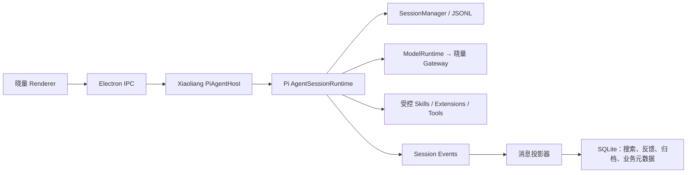

对，建议把 Pi Coding Agent 作为晓量的通用 Agent Runtime，避免继续自行实现 session、queue、compaction、retry、tree 等通用能力。但接入的是 SDK/runtime 层，不是把 Pi 的 CLI/TUI 整套搬进晓量。

目标边界应当是：



Pi 负责 Agent 通用语义，晓量继续负责项目、图纸、计费、权限、CAD、云同步和桌面 UI。

## 能力规划

| 能力组 | 计划集成的 Pi 能力 | 复杂度 |
|---|---|---:|
| 运行生命周期 | `AgentSession`、`AgentSessionRuntime`、abort、`waitForIdle`、settled | 中 |
| 实时交互 | steer、followUp、queue modes、queue 状态、clear queue | 低 |
| Session 管理 | new、open、resume、list、name、stats、model/thinking 持久化 | 中高 |
| 会话导入导出 | JSONL import/export、HTML export | 中 |
| 可靠性 | 自动 retry、指数退避、provider retry、错误恢复 | 中 |
| 上下文管理 | 手动/自动 compaction、overflow compact-and-retry | 中高 |
| 分支能力 | Tree、navigate、fork-before、clone-at、labels、branch summary | 中高 |
| 扩展体系 | inline extensions、skills、prompt templates、动态工具、reload | 中高 |
| 编程工具 | read、grep、find、ls、edit、write、bash | 高，主要是安全成本 |
| Pi Packages | 安装、更新、第三方扩展包 | 很高，后期再考虑 |

这些 API 已经集中在 [agent-session.ts](E:/062026/xiaoliang/my-projects/pi-engineering/packages/coding-agent/src/core/agent-session.ts:303)，不需要晓量继续分别实现。

## 分阶段实施顺序

实施顺序按依赖关系排，不是简单从易到难。

### 阶段 0：运行时与依赖基线

复杂度：中高；前置阶段。

当前晓量 Electron 33 使用 Node 20.18.3，而 Pi Coding Agent 0.83 要求 Node ≥22.19，参考桌面端使用 Electron 43.2.0。因此先完成：

- Electron 33 → 能提供 Node ≥22.19 的版本，优先跟随 `pi-engineering` 的 Electron 43。
- TypeScript 5.7 → 5.9。
- 重新验证 `better-sqlite3`、`keytar`、Electron rebuild 和安装包。
- 统一使用一套 `@earendil-works/pi-*` 版本，避免同时存在 `@mariozechner 0.67.6` 和 `@earendil-works 0.83.0` 两套消息类型/runtime。
- 精确锁定 Pi 版本，不使用宽松版本范围。
- 建立功能开关：
  - `pi_runtime_v2`
  - `pi_session_jsonl`
  - `pi_branching`
  - `pi_extensions`
  - `pi_coding_tools`

验收：现有聊天、CAD、登录、计费、打包行为完全不变。

### 阶段 1：引入 PiAgentHost，先做运行时等价替换

复杂度：高；这是整个迁移的核心。

新增独立 `XiaoliangPiAgentHost`，使用：

- `createAgentSessionRuntime()`
- `createAgentSession()`
- `AgentSession`
- `ModelRuntime`
- `SessionManager.inMemory()`，初期先不切持久化

把现有能力适配进去：

- 晓量托管 Gateway 和动态凭证。
- 当前 system prompt、`transformContext`、项目/CAD 上下文。
- 当前 CAD、项目文件、Web、子代理工具。
- `beforeToolCall` 审批机制。
- 计费和 usage aggregator。
- Pi Event → 现有 `AgentUiEvent` 的映射。
- generation/sequence，丢弃旧 runtime 的迟到事件。
- session 替换时解除旧订阅、abort/wait、重新绑定新 session。

ResourceLoader 初期必须关闭自动发现：

```text
noExtensions = true
noSkills = true
noPromptTemplates = true
noThemes = true
noContextFiles = true
```

只加载晓量明确注入的 extension/tool。参考实现已经这样处理：[agent-host.ts](E:/062026/xiaoliang/my-projects/pi-engineering/engineering/desktop/src/main/agent/agent-host.ts:926)。

验收：同一输入下，新旧 runtime 的消息、工具执行、计费、停止行为等价。此阶段不提供 Tree。

### 阶段 2：先上线 steer、followUp、queue、waitForIdle

复杂度：低；第一批用户可见收益。

接入：

- `waitForIdle()`：停止、切换会话、退出应用前安全等待。
- `abort()`：停止后确保 tool result 和中止消息已经落盘。
- `steer()`：当前 assistant 回合及工具执行结束后，在下一次模型调用前插入。
- `followUp()`：Agent 原本将结束时继续下一轮。
- `queue_update`：向 UI 输出 steer/followUp 数量和预览。
- `clearQueue()`：撤回尚未执行的排队消息。
- `agent_settled`：真正结束整次工作。

建议的计费语义：

- steer：属于当前 `client_run_id`。
- 在当前运行中加入的 followUp：也属于当前 run，作为额外 LLM call 记录 usage contribution。
- Agent settled 以后重新发送的消息：创建新 run。
- 不能在第一次 `agent_end` 就结算，因为 Pi 的 `agent_end` 可能带 `willRetry=true`；应在 `agent_settled` 后完成计费和 UI 收尾。相关事件定义见 [agent-session.ts](E:/062026/xiaoliang/my-projects/pi-engineering/packages/coding-agent/src/core/agent-session.ts:139)。

验收：连续 steer/followUp、停止、重试、工具调用期间不会提前结算或丢消息。

### 阶段 3：切换 Session 事实源并迁移旧对话

复杂度：高；最大的数据迁移阶段。

目标：

- Pi JSONL 成为消息、工具结果、上下文和 Tree 的唯一事实源。
- SQLite 继续作为业务数据库和消息投影。

建议新增：

```text
conversation_session_bindings
- conversation_id
- pi_session_id
- pi_session_file
- parent_conversation_id
- forked_from_entry_id
- runtime_version
- migration_status
```

现有 `messages` 表继续服务：

- 当前活动路径渲染
- 全局搜索
- 消息反馈
- 项目云归档

建议补充 `pi_session_id`、`pi_entry_id`，以后消息身份优先采用：

```text
pi:<sessionId>:<entryId>
```

迁移方式：

1. 新对话直接创建 Pi session。
2. 旧对话首次打开时懒迁移。
3. 把 `agent_state.messages` 导入为一条线性 session。
4. 保存旧消息 ID → Pi entry ID 映射，避免反馈和云归档失联。
5. 原 `agent_state` 保存为只读迁移备份，不立即删除。
6. 旧压缩摘要导入为 legacy checkpoint；已经被旧压缩删除的更早历史无法重建，不能伪造 Tree。

这一阶段同时接入：

- new/open/resume/list
- session name
- session stats
- model/thinking level 恢复
- JSONL/HTML export
- JSONL import

验收：重启、升级、异常退出后，JSONL 与 SQLite 活动路径投影完全一致；SQLite 投影可以从 JSONL 重建。

### 阶段 4：替换 compaction 和 retry

复杂度：中高。

先接 retry：

- 可重试错误分类。
- 指数退避。
- retry 倒计时和次数 UI。
- 用户停止时取消 retry。
- 主模型、compaction、branch summary 共用一致的重试策略。

再逐级接 compaction：

1. 手动 compact。
2. 达到阈值后的自动 compact。
3. context overflow 后 compact-and-retry。
4. compaction usage/cost 计入当前 run。
5. UI 展示压缩开始、完成、失败状态。

确认 Pi compaction 稳定后，删除当前会直接替换 `messages[]` 的自研 compactor。两套 compaction 不能同时运行。

Pi 的优势是：模型上下文被压缩，但完整历史仍在 session Tree 中；当前晓量的实现会把旧消息从本地快照中移除。

验收：压缩前历史仍可在 Tree 查看，overflow 可以自动恢复，压缩不会重复收费或反复触发。

### 阶段 5：Tree、fork、clone 和分支摘要

复杂度：中高，但此时 Pi 核心工作已经完成，主要成本在 UI 和业务映射。

建议顺序：

1. 只读 Tree 弹层。
2. 标记当前 active path 和 leaf。
3. Tree navigate，不生成摘要。
4. fork-before：从用户消息之前创建新晓量 conversation，并回填原用户文本。
5. clone-at：从当前节点创建新 conversation，输入框保持空白。
6. assistant clone-at 时保留其紧随的关联 tool results。
7. labels/bookmarks。
8. Tree navigate 时可选 branch summary。
9. conversation 列表展示父子 session family。

需要明确：

- Tree navigate：仍是同一个晓量 conversation。
- fork/clone：创建新的 SQLite conversation，并绑定新的 Pi session。
- `parentSession` 是 Pi 的文件关系；`parent_conversation_id` 是晓量业务关系，两者同时维护。

云同步第一版可只同步活动路径，但必须显式标记。后续若要跨设备恢复完整 Tree，需要升级后端归档协议，上传 entry/parent/leaf，而不是继续只传线性 messages。

验收：Tree 切换、fork、clone 后消息、composer、反馈 ID、项目归属、usage 和会话列表都一致。

### 阶段 6：Extensions、Skills 和 Prompt Templates

复杂度：中高；主要风险是信任边界。

推荐先接受控资源：

- 晓量内置 inline extensions。
- 晓量云同步下来的签名 skills 目录。
- 项目级 prompt templates。
- 动态工具注册和 `setActiveTools()`。
- resource reload。
- extension session lifecycle。
- 用 extension hooks 逐步替代当前散落的上下文注入和工具拦截逻辑。

适合迁入 extension 的现有能力：

- Gateway header 注入。
- CAD 工具注册。
- 工具审批与受保护路径。
- `before_agent_start` 动态上下文。
- session start/shutdown 清理。
- 自定义 compaction/branch summary 策略。
- 子代理 delegate 工具。

初期不要开放：

- 任意用户目录 extension 自动发现。
- 项目仓库里的任意 TypeScript extension。
- 自动安装第三方 Pi Packages。
- 未签名扩展代码。

Skills 是提示和流程资源，风险低于可执行 extension，可以先开放；extension 本质上是任意代码执行，必须经过签名、审核和 allowlist。

### 阶段 7：编程智能体工具

复杂度：高；主要是安全和产品定位，不是 Pi API 难度。

建议建立能力配置，而不是所有会话统一开放：

| Agent 配置 | 工具 |
|---|---|
| CAD 主 Agent | 晓量业务工具、delegate、受控项目读取 |
| 项目资料 Agent | read、grep、find、ls，无写入 |
| Coding Agent | read、grep、find、ls、edit、write、受控 bash |

实施顺序：

1. `read / grep / find / ls`
2. `edit / write`，提供 diff 预览和用户确认
3. 文件修改队列，避免并发写冲突
4. 受保护文件和项目根路径检查
5. `bash`，最后上线
6. bash 超时、输出上限、环境变量清洗和进程树终止
7. 可选 Git checkpoint、改动摘要和恢复点

不要把 unrestricted bash 直接加给现有 CAD 主 Agent。Coding Agent 应是独立能力档位或独立工作区模式。

## 不建议迁入的 Pi 功能

以下能力在桌面端价值不高或已有晓量实现：

- Pi TUI、主题和终端快捷键。
- CLI `/login`、`/logout`。
- Pi 自带 provider credential 文件。
- CLI session picker。
- Gist `/share`。
- CLI/RPC mode。
- 自动从用户 `~/.pi` 或项目 `.pi` 加载资源。
- 无审核的 Pi Package 安装和更新。

这些应由晓量 Renderer、IPC、账号系统和插件/技能中心承接。

## 风险最高的五个点

1. Electron/Node、TypeScript 和 native module 升级。
2. JSONL 与 SQLite 不能出现双事实源。
3. 旧消息 ID、反馈、搜索和云归档身份迁移。
4. retry/queue/compaction 下的计费结算时机。
5. extension、write、bash 的安全边界。

## 最终建议

推荐路线是：

```text
运行时升级
→ PiAgentHost 等价替换
→ steer/followUp/queue/waitForIdle
→ Pi Session + 旧会话迁移
→ retry + compaction
→ tree/fork/clone
→ skills/extensions
→ coding tools
```

这样前两阶段解决架构问题，之后大部分能力都只是 Pi API 的桌面投影，不再重复实现核心算法。最不应该做的是先在当前 `agent_state + DELETE/INSERT messages` 模型上单独开发 Tree，然后再迁 Pi；那部分代码后面基本会被推翻。